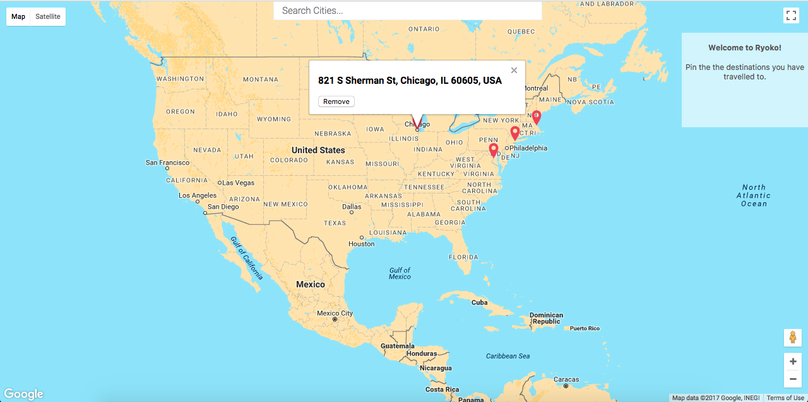
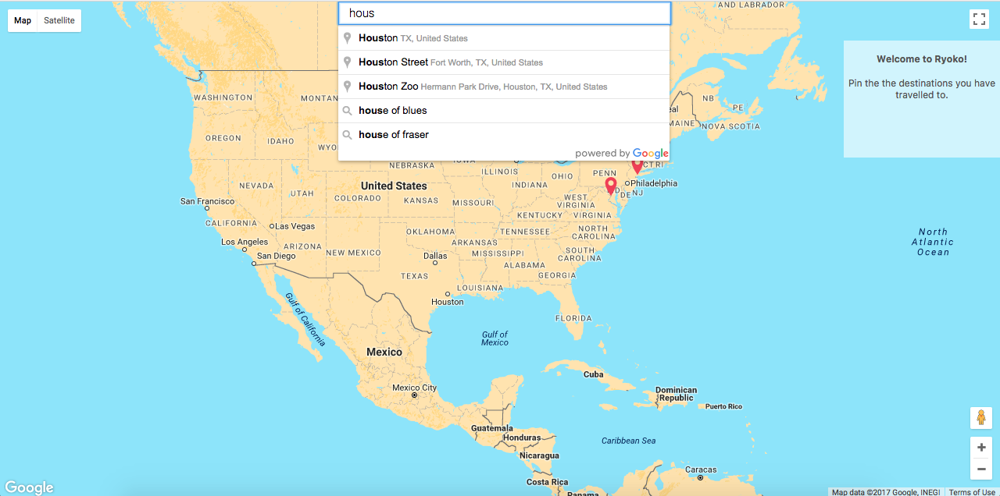
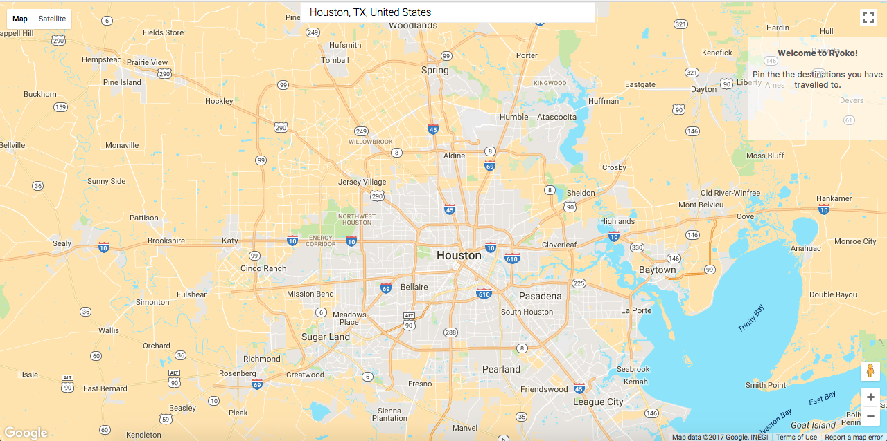
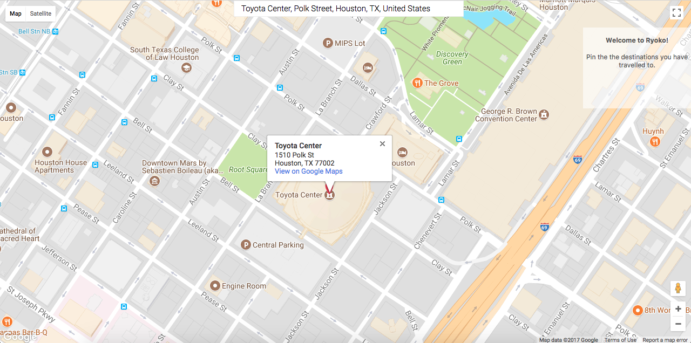

# Ryoko

A Chrome extension for adding markers to the locations a user has traveled to using Google Maps.

## Getting Started
Clone or download the repository
Replace the API_KEY within the script tag, in popup.html with your own API KEY

## Instructions
Go to Extensions within your chrome browser  
Click on Load unpacked extensions  
Select the downloaded folder  
Enable Ryoko extension  
The Ryoko - Extension icon should appear  

You are ready to go :)

